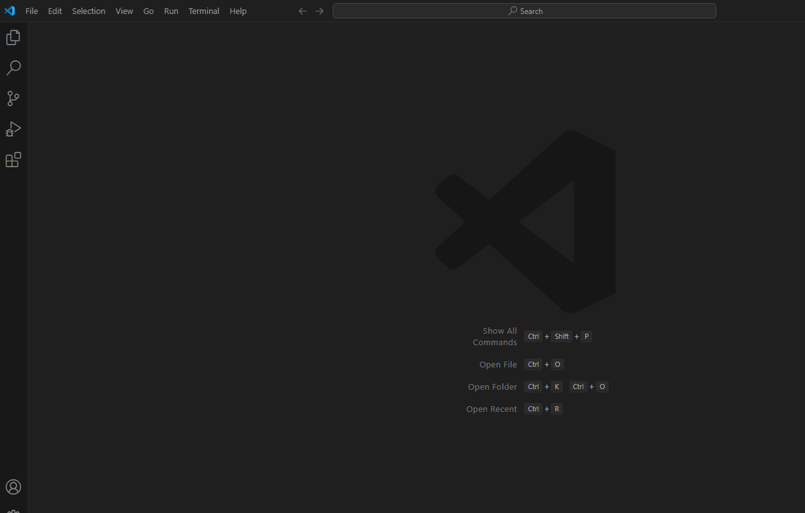
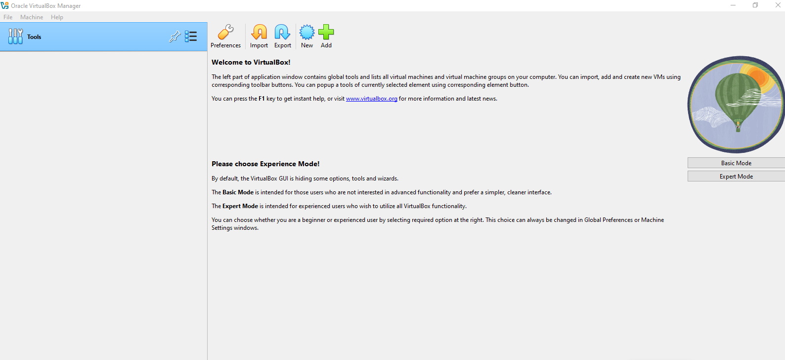
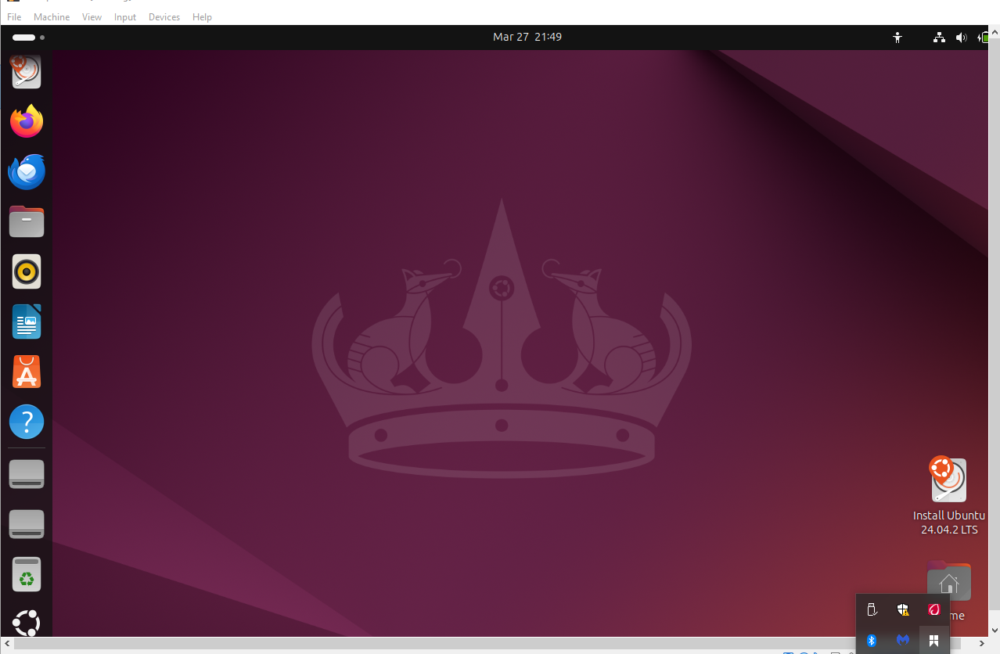
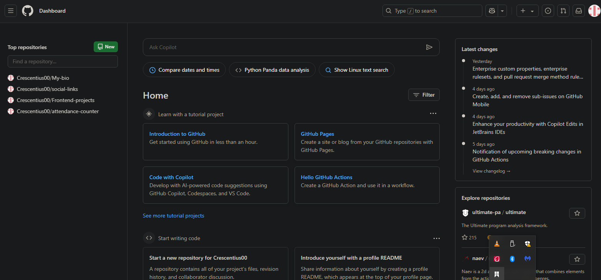
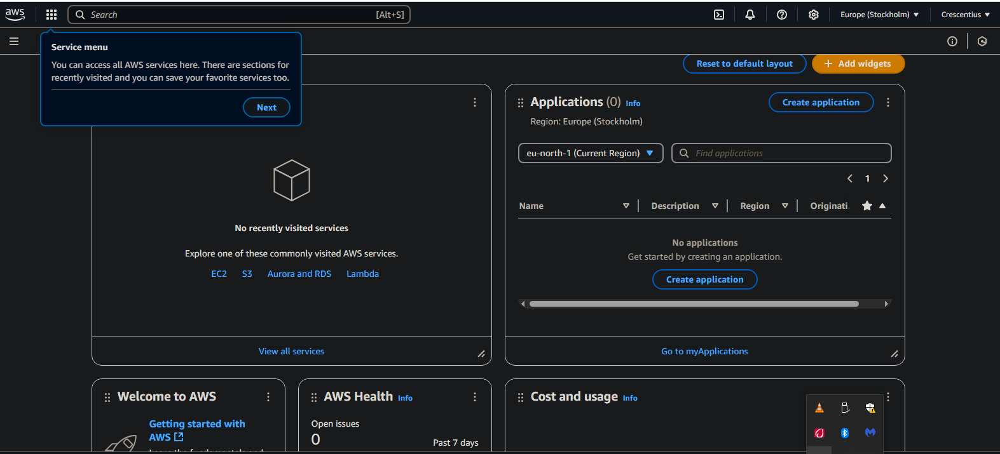

# Technical-Enviroment

Introduction
------------
This is the technical enviroment setup mini project.

It covers the installation and configuration of the essential tools needed for this course.

It also covers the signing up for key web portals like AWS and GitHub, which are also crucial for building professional profile.

Project Details
---------------

1. VISUAL STUDIO CODE:

    I installed Visual Studio Code.

    

    Visual Studio Code (VS Code) is a fast, lightweight, and highly customizable code editor by Microsoft. It supports various programming languages, extensions, and built-in Git integration, making it a favorite among developers for coding, debugging, and collaboration.

2. GIT:

    I installed Git.

    

    Git is a distributed version control system that helps developers track changes in code, collaborate efficiently, and manage projects. It allows multiple people to work on the same codebase without conflicts by keeping a history of changes. With Git, you can commit changes, create branches, merge updates, and revert to previous versions if needed. It is widely used in software development, especially in DevOps, to streamline code deployment and collaboration.

3. VIRTUAL BOX:

    I also downloaded and installed virtual box.

     

    VirtualBox is a free and open-source virtualization software developed by Oracle. It allows users to run multiple operating systems on a single machine by creating virtual machines (VMs). With VirtualBox, you can test different operating systems, set up development environments, and run isolated applications without affecting your main system. It is widely used in DevOps, cloud computing, and software testing to create and manage virtual environments efficiently.

4. UBUNTU:

    I downloaded ubuntu OS, created a virtual machine in my virtual box and installed the ubuntu in it.

    

    Ubuntu is a popular open-source Linux operating system. Ubuntu is widely used in cloud computing, server management, and software development.

5. GITHUB ACCOUNT:

    I opened GitHub and signed up.

    

    A GitHub account allows you to access GitHub, a cloud-based platform for hosting and managing Git repositories.

6. AWS ACCOUNT:

    I also created an AWS account.

    

    An AWS account gives you access to Amazon Web Services (AWS), a cloud computing platform that provides scalable computing power, storage, and various cloud services.